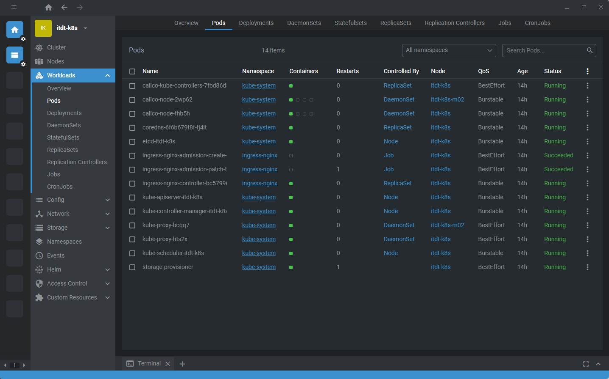
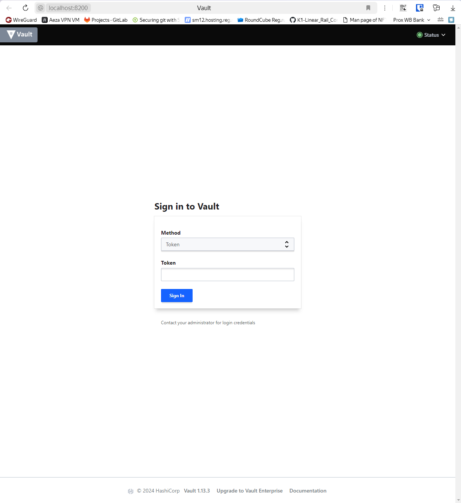
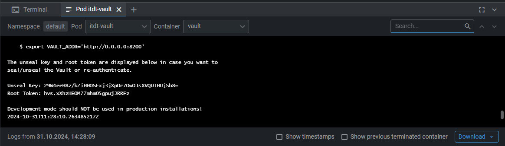
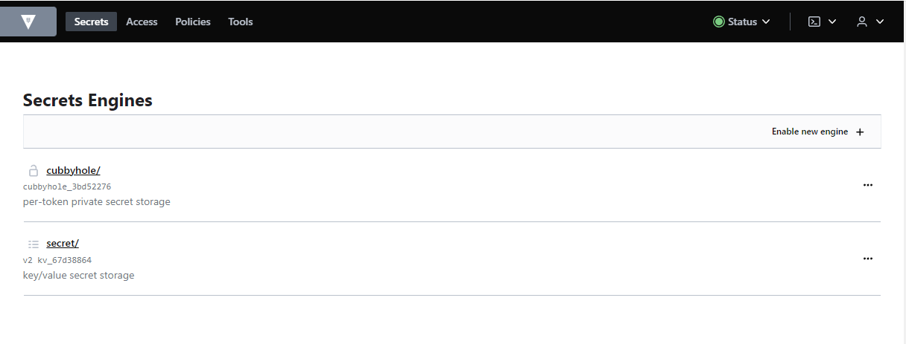
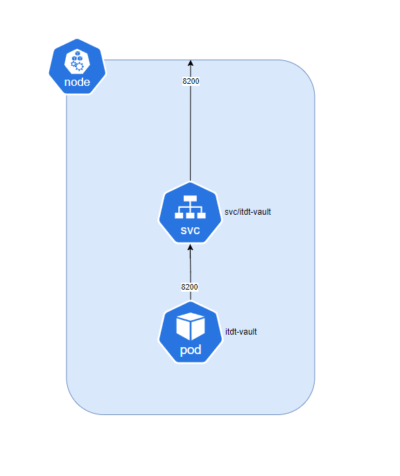

University: [ITMO University](https://itmo.ru/ru/)
Faculty: [FICT](https://fict.itmo.ru)
Course: [Introduction to distributed technologies](https://github.com/itmo-ict-faculty/introduction-to-distributed-technologies)
Year: 2024/2025
Group: K4110c
Author: Khakimov Lev Nailevich
Lab: Lab1
Date of create: 31.10.2024
Date of finished: 
---
## Ход работы
1) Создать кластер. В качестве CNI будем использовать Calico, кластер будет состоять из 2-х нод и иметь название `itdt-k8s`
```bash
minikube start --network-plugin=cni --cni=calico --nodes 2 -p itdt-k8s
```

2) Для удобства визуализации работы с кластером будем использовать OpenLens


3) Напишем [манифест](itdt-vault-pod.yml)

4) Применим через 
```bash 
kubectl apply -f lab1/itdt-vault-pod.yml
```

5) Создадим сервис типа NodePort при помощи консоли
```bash
minikube -p itdt-k8s kubectl -- expose pod itdt-vault --type=NodePort --port=8200
```

6) Сделаем проброс портов при помощи port-forward
```bash
 minikube -p itdt-k8s kubectl -- port-forward service/itdt-vault 8200:8200
 ```

 7) Посетим `http://localhost:8200`
 

 8) Через Lens найдем в логах root токен и залогинимся
 

 Инетерфейс Vault
 

 9) Составим схему в draw.io
 