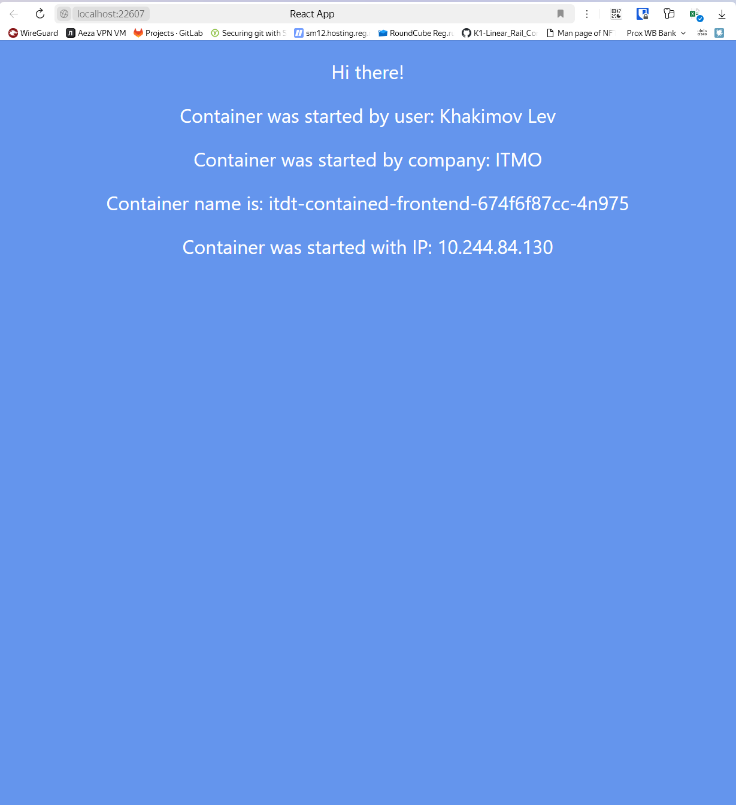
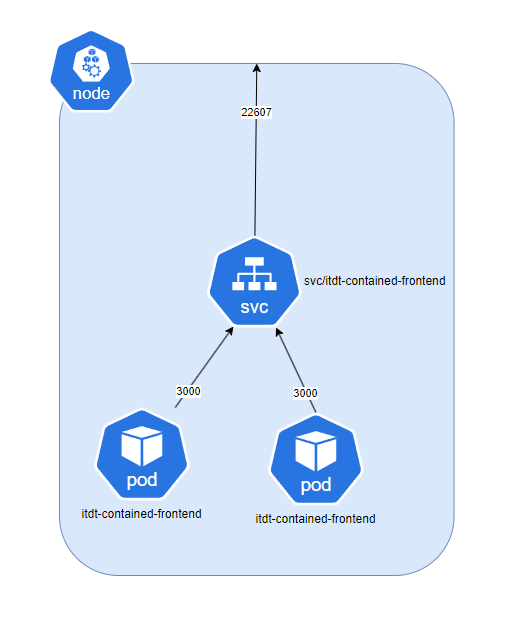

University: [ITMO University](https://itmo.ru/ru/)
Faculty: [FICT](https://fict.itmo.ru)
Course: [Introduction to distributed technologies](https://github.com/itmo-ict-faculty/introduction-to-distributed-technologies)
Year: 2024/2025
Group: K4110c
Author: Khakimov Lev Nailevich
Lab: Lab2
Date of create: 31.10.2024
Date of finished: 
---

1) Напишем манифесты [Deployment](itdt-front-deployment.yml) и [Service](itdt-front-svc.yml)

2) Применим их через 
```bash
kubectl apply -f lab2
```

3) Дождемся, когда поднимутся поды и сделаем port-forwarding


4) Схема в draw.io
