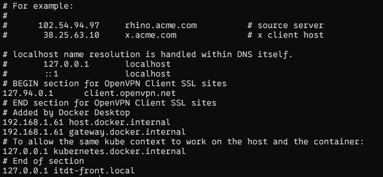
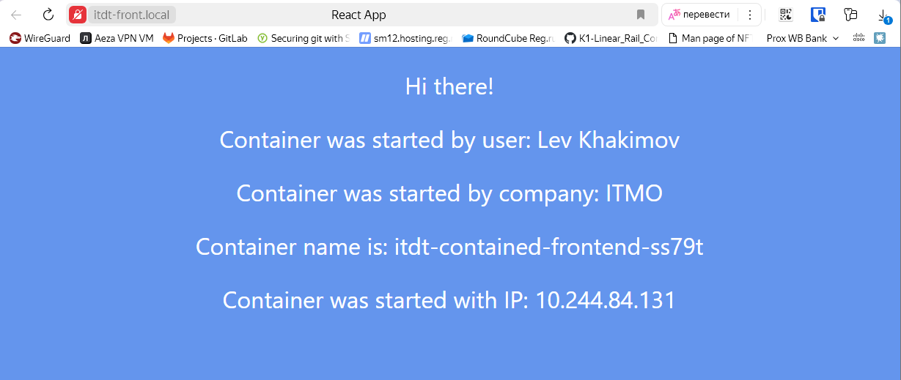
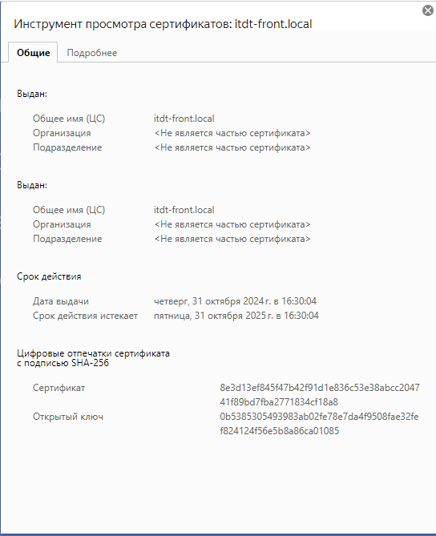

University: [ITMO University](https://itmo.ru/ru/)  
Faculty: [FICT](https://fict.itmo.ru)  
Course: [Introduction to distributed technologies](https://github.com/itmo-ict-faculty/introduction-to-distributed-technologies)  
Year: 2024/2025  
Group: K4110c  
Author: Khakimov Lev Nailevich  
Lab: Lab3  
Date of create: 31.10.2024   
Date of finished: 31.10.2024  
---

0. Включаем аддон ingress 
```bash 
minikube -p itdt-k8s addons enable ingress
```

1. Создаем сертификаты командой
```bash
openssl req -x509 -nodes -days 365 -newkey rsa:2048 -keyout itdt-front.local.key -out itdt-front.local.crt -subj "/CN=itdt-front.local"
```

2. Создаем Secret при помощи команды
```bash
kubectl create secret tls itdt-contained-frontend-certs --cert=itdt-front.local.crt --key=itdt-front.local.key
```

3. Тип сервиса меняем на ClusterIP. Заменяем Deployment на ReplicaSet

4. Создаем [Ingress](itdt-istio-ingress.yml), указываем наш домен `itdt-front.local` и название секрета

5. Создаем [ConfigMap](itdt-front-configmap.yml), переносим туда env из бывшего Deployment, в replicaSet делаем evFrom и делаем референс на созданный ConfigMap

6. Добавляем в `C:\Windows\system32\drivers\etc\hosts` запись


7. Открываем тоннель
```bash 
minikube tunnel
```

8. Проверяем, что сайт работает. Замок красный, так как сертификат не добавлен в доверенные на системе

Содержимое сертификата:
