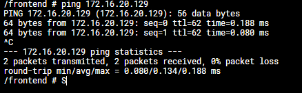

University: [ITMO University](https://itmo.ru/ru/)  
Faculty: [FICT](https://fict.itmo.ru)  
Course: [Introduction to distributed technologies](https://github.com/itmo-ict-faculty/introduction-to-distributed-technologies)  
Year: 2024/2025  
Group: K4110c  
Author: Khakimov Lev Nailevich  
Lab: Lab4  
Date of create: 31.10.2024  
Date of finished:   
---

1. Calico мы уже добавили в 1 лабораторной работе

2. Назначаем метки узлам по географическому положению
```bash
kubectl label nodes itdt-k8s zone=east  
kubectl label nodes itdt-k8s-m02 zone=west
```

4. Создаем IPPool-ы для east и west зон
```bash 
kubectl apply -n kube-system -f .\itdt-ippools.yml
```

5. Получаем список ippool-ов 
```bash
kubectl exec -i -n kube-system calicoctl -- calicoctl --allow-version-mismatch get ippools -o wide
```

6. Удаляем пул по умолчанию
```bash
kubectl delete ippools default-ipv4-ippool
```

7. Добавляем созданные нами IPPool-ы
```powershell
cmd.exe /c "kubectl exec -i -n kube-system calicoctl -- calicoctl --allow-version-mismatch create -f - < itdt-ippools.yml"
```

8. Деплоим приложение из lab3

9. Проверяем ping-и
